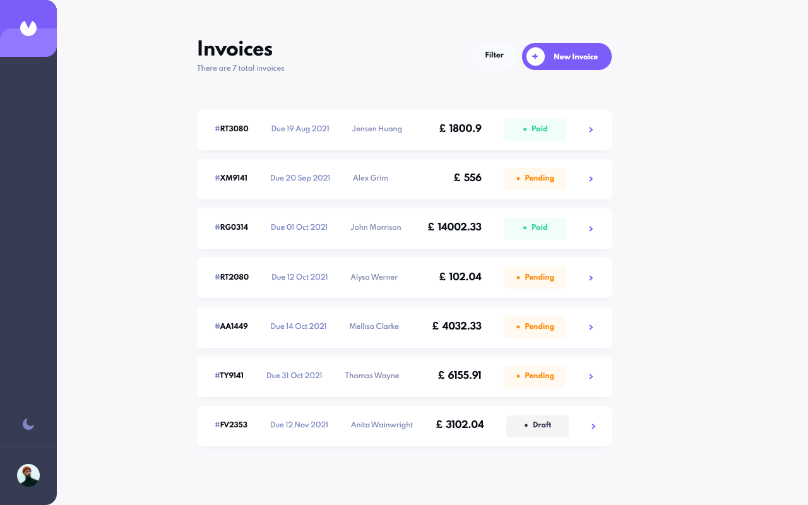

# Invoices app

Working app is accessible at [demo page](https://invoices-dbatishchev.netlify.app/)

### Built with

- Typescript
- React
- Mobx
- React Router
- Formik
- CSS Modules
- CSS custom properties
- Flexbox & CSS Grid

### Users could:

- See list of invoices
- Filter invoices by status
- Change theme (bright / dark)

- Create, read and update invoices

- See full invoice info

